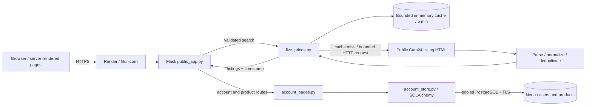
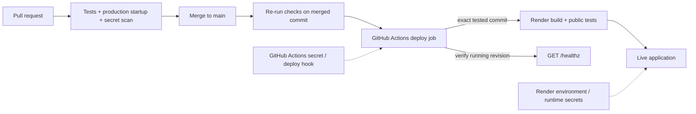
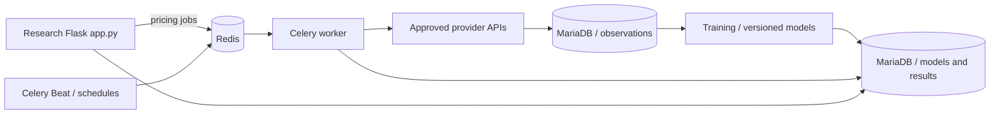

# PriceScout

**Current asking prices. Clear sources. A place to keep your products.**

[Live app](https://pricescout-urwq.onrender.com/) · [Products](https://pricescout-urwq.onrender.com/products) · [Research paper](https://doi.org/10.1109/AIIoT58432.2024.10574547)

PriceScout grew out of a capstone project investigating a practical problem: a resale model trained on yesterday’s market can miss today’s prices. I’m **Aarav Babu**, the sole maintainer of the current application. I’m developing that research into a small, observable, publicly hosted product.

## Why collect prices at search time?

Used-product prices move as inventory, demand, new releases, and product age change. A static CSV remains a snapshot of the market when it was collected—even if the prediction model is sophisticated. Looking up current comparable listings gives a buyer or seller more timely evidence.

PriceScout’s public car search fetches listing HTML on a cache miss, extracts current asking prices, and shows the source links and collection time. Identical searches reuse a snapshot for up to **five minutes**, balancing freshness, response time, and load on the source. “Live” means recently observed listings; it does not mean a continuous feed, completed-sale prices, or a guaranteed valuation.

Scraping is the current adapter for public listing pages. An appropriate licensed API could provide the same freshness benefit with a more stable interface. The system does not bypass authentication, CAPTCHAs, or access controls.

## What is live today?

| Capability | Public release |
| --- | --- |
| Used cars in India | Current Cars24 asking-price comparisons, filters, source links, checked timestamp |
| Price summary | Lowest, median, and highest asking price within the returned sample |
| Accounts | Registration, sign-in, sign-out; hashed passwords and CSRF-protected forms |
| Phones and laptops | Private saved specifications and condition; **pricing unavailable** |
| Persistence | Neon PostgreSQL, independent of Render’s temporary filesystem |
| Operations | GitHub Actions tests, secret scanning, deployment, and commit-specific health verification |

## System architecture

The live service is a modular Flask application, deployed as one small web process. Price lookup and account storage are separate paths: browsing car prices does not require an account or a database query.



### Search request path

1. Validate brand, model, city, and optional filters. Construct a URL on a fixed source host; users cannot supply an arbitrary fetch URL.
2. Apply per-client throttling, then consult the URL-keyed cache. A hit retains its original collection timestamp.
3. On a miss, serialize outbound fetches and enforce minimum spacing. Bound connection/read timeouts and downloaded response size.
4. Parse the first page, normalize Indian price units, distinguish current asking price from EMI/old prices, and remove duplicate links. Keep at most 50 parsed listings.
5. Apply model/year/fuel/transmission filters to that sample, sort by price, and compute descriptive summaries.
6. Render source links, collection time, and sample limitations. If the source is unavailable or cannot be parsed, return an explicit error; never substitute invented listings.

### Account and data boundary

The browser holds a signed session cookie, not the database connection string. Registration hashes passwords with Werkzeug; login checks the stored hash. Every product lookup includes the signed-in user ID, preventing access through another user’s product URL. All state-changing forms require CSRF tokens.

| Table | Purpose | Relationship |
| --- | --- | --- |
| `public_users` | UUID, name, unique email, password hash, creation time | One account owns many products |
| `public_products` | UUID, owner ID, category, brand, model, serialized specifications, creation time | Foreign key to `public_users`; owner index |

The SQLAlchemy store uses transactions for writes and checks pooled connections before reuse. The public tables are separate from the research application’s schema. Local development uses an ignored SQLite file; hosted accounts require PostgreSQL configuration. Database failures do not prevent the public car-search page from loading.

### Design decisions and tradeoffs

| Decision | Reason | Limit / next step |
| --- | --- | --- |
| One Gunicorn worker, four threads | Fits the free instance; keeps cache and request coordination in one process | Multiple workers need shared cache, throttling, and fetch coordination |
| Requests + BeautifulSoup | Avoids a browser runtime for the current public HTML source | Source markup changes can break parsing; maintain fixture coverage |
| Five-minute cache, maximum 128 queries | Bounds memory and avoids repetitive source requests | Not a full-market history; timestamps must remain visible |
| First-page sample, maximum 50 listings | Keeps latency and source traffic bounded | Results may omit inventory or include nearby locations |
| PostgreSQL outside the web host | Accounts survive deploys and restarts | Network/database wake-up adds latency; free tiers have quotas |
| Server-rendered templates | A single deployable application with little client-side state | Richer interactions can be added when useful |
| Explicit failure states | Preserves trust when collection fails | Availability depends on the upstream listing source |

## CI/CD and secret boundaries



PRs run checks without deploying. A successful `main` run triggers Render through the encrypted **`RENDER_DEPLOY_HOOK` GitHub Actions secret**, then waits until `/healthz` reports the tested commit. Deployment requests are serialized, and stale queued commits are skipped. A failed health verification fails the deployment job.

**`DATABASE_URL` and `SECRET_KEY` belong in Render’s environment settings.** GitHub does not need either to test or deploy. Documentation lists variable names and configuration instructions only; never paste real credentials into Markdown, YAML, issues, or workflow output. See [DEPLOYMENT.md](DEPLOYMENT.md) for setup and rollback.

## Research origin and the separate ML pipeline

The [2024 IEEE AIIoT paper](https://doi.org/10.1109/AIIoT58432.2024.10574547) explored query-specific scraping, automated preprocessing, and regression on small used-car datasets. It compared linear, ridge, decision-tree, gradient-boosting, and random-forest approaches; the study selected a 30-tree random forest for its response to changing item features. Small samples and limited evaluation remain important constraints; the paper is research context, not a production accuracy guarantee.

The repository also preserves a **separate research implementation**: Flask + MariaDB + Redis + Celery, authorized provider adapters, scheduled collection, and versioned scikit-learn models. That stack is **not running behind the public Render site**. The live site currently shows observed car listing prices, not ML predictions.



Provider approval, market/currency alignment, observation retention, and enough representative data are prerequisites for using that pipeline. See [DATA_SOURCES.md](DATA_SOURCES.md) and [DEPLOY.md](DEPLOY.md).

## Run locally

Python 3.11 is used in CI and hosting.

```bash
python3.11 -m venv .venv
.venv/bin/pip install -r requirements.txt -r requirements-public.txt
.venv/bin/python -m unittest discover -s tests -v
.venv/bin/python public_app.py
```

Open `http://127.0.0.1:5002`. Local accounts use `instance/accounts.db` unless `DATABASE_URL` is set. No production credentials are needed. Tests use isolated temporary databases and mocked source responses; live upstream checks are performed separately.

For the optional research stack, follow [DEPLOY.md](DEPLOY.md); its Docker entry point is `app:app`, not `public_app:app`.

## Repository map

| Path | Responsibility |
| --- | --- |
| `public_app.py` | Public routes, search summaries, response security, health endpoint |
| `live_prices.py` | Input validation, source fetch, parsing, cache, fetch coordination |
| `account_pages.py` / `account_store.py` | Authentication, private products, database access |
| `templates/public/` / `static/css/` | Public UI and green/cream design |
| `.github/workflows/ci.yml` | Tests, secret scanning, deployment and verification |
| `scripts/deploy_render.py` | Redacted deploy-hook invocation and revision verification |
| `render.yaml` | Public web-service build/start configuration |
| `app.py`, `pricing_pipeline.py`, `market_model.py`, `celery_worker.py` | Separate research application and asynchronous ML pipeline |
| `tests/` | Parser, cache, account isolation, persistence, and research-pipeline tests |

## Next engineering milestones

- Add approved phone/laptop sources before enabling their price results.
- Add email verification, password recovery, and account/product deletion.
- Introduce schema migrations before changing deployed columns.
- Move coordination to a shared store before scaling beyond one worker.
- Measure freshness, source failure rate, and lookup latency; evaluate models on representative held-out data before presenting valuations.

Render’s free service can sleep between visits, and both hosting services have usage quotas. This release is a public beta maintained by Aarav Babu.
